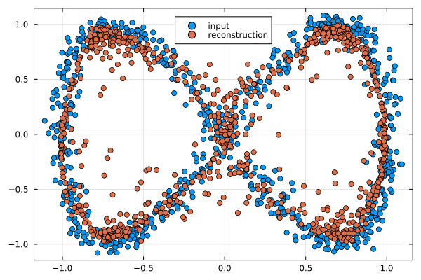
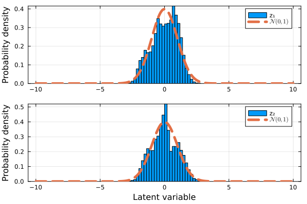
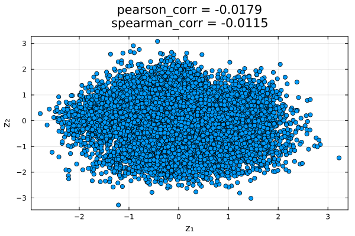

# Generative Adversarial Networks

To demonstrate how to use this module, we will train a Wasserstein Generative 
Adversarial Network (WGAN) [Ian2014, Arjovsky2017](@cite), using a Variational 
Autoencoder (VAE) as the generative model (VAE) [Diederik2013, 
Larsen2015](@cite), to generate synthetic data that mirrors a two-dimensional 
target distribution. The VAE must learn to mimic this distribution using only 
the provided training samples, without direct access to the true underlying 
distribution or the ability to sample additional data.

For this example we will need to load the following modules
```julia
using Lux
using GenerativeModelProtocols
```
let us consider the following function to generate our random two-dimensional 
data
```julia
function make_data(num_samples)
    t = (2.0*π) .* rand(Float64,num_samples)

    x_noise = 0.05 .* randn(Float64,num_samples)
    y_noise = 0.05 .* randn(Float64,num_samples)

    x = cos.(1.0.*t) .+ x_noise
    y = sin.(2.0.*t) .+ y_noise
    
    return x, y
end

num_samples = 5000
x_train, y_train = make_data(num_samples)
train_data = collect(transpose(hcat(x_train,y_train)))
```
we then define the WGAN-VAE that is to be trained on this data, whose latent 
variables are also two-dimensional as
```julia
model = GenerativeModelProtocols.GenerativeAdversarialNetwork(2, 2)
```
however, unlike our VAE implementation that uses only one optimiser, we want 
to specify (in general) different optimiser settings for the cost function of 
the critic and the generator models, which we do as
```julia
critic_optimiser = Adam(; eta = 1.0E-4, beta = (0.0,0.9))
vae_optimiser = Adam(; eta = 1.0E-4, beta = (0.95,0.999))
```
thus, our trainable generative model protocol is defined, and trained, as
```julia
protocol = GenerativeModelProtocol(model,train_data;
    batchsize   = 256,
    epochs      = 1500,
    optimiser   = (critic_optimiser, vae_optimiser),
    device      = cpu_device()
)
train!(protocol; β = 0.2, γ_vae = 1.0, γ_wgan = 0.1,
    grad_penalty = true, λ = 10.0, a = 1.0
)
```
finally, we can generate synthetic data by simply invoking our trained protocol
```julia
synthetic_data = protocol(num_samples)
```


## Displaying models and protocols

As part of this module, `Base.display` is overloaded with most relevant 
structures that users can need. We can easily read the configuration of 
`protocol` from the REPL by inputting
```julia-repl
julia> protocol
GenerativeModelProtocol{GenerativeModelProtocols.GenerativeAdversarialNetwork, Adam{Float64, Tuple{Float64, Float64}, Float64}}:
training_data = 2×5000 Matrix{Float64}
epochs        = 1500
batchsize     = 256
shuffle       = true
optimiser     = (Adam(eta=0.0001, beta=(0.0, 0.9), epsilon=1.0e-8), Adam(eta=0.0001, beta=(0.95, 0.999), epsilon=1.0e-8))
device        = CPUDevice
model         = GenerativeModelProtocols.GenerativeAdversarialNetwork
```
likewise, we can also read the configuration of `model` from the REPL by
inputting
```julia-repl
julia> model
GenerativeModelProtocols.GenerativeAdversarialNetwork:
discriminator: 
   Chain(
      Dense(2 => 32, leakyrelu)
      Dense(32 => 32, leakyrelu)
      Dense(32 => 32, leakyrelu)
      Dense(32 => 32, leakyrelu)
      Dense(32 => 32, leakyrelu)
      Dense(32 => 1)
   )

encoders: 
   Chain(
      Dense(2 => 32, leakyrelu)
      Dense(32 => 32, leakyrelu)
      Dense(32 => 32, leakyrelu)
      Dense(32 => 32, leakyrelu)
      Dense(32 => 32, leakyrelu)
      Dense(32 => 4)
   )

decoders: 
   Chain(
      Dense(2 => 32, leakyrelu)
      Dense(32 => 32, leakyrelu)
      Dense(32 => 32, leakyrelu)
      Dense(32 => 32, leakyrelu)
      Dense(32 => 32, leakyrelu)
      Dense(32 => 2)
   )
```

## Model validation

So far, we have only validated our model by verifying that its synthetic data 
resembles the training data. However, we can perform at least two additional 
tests to assess whether the model is functioning as intended:
* __Test Data Reconstruction__: Encode and decode a separate, unseen test 
  dataset to see if the reconstructed data closely resembles the original.
* __Latent Space Validation__: Verify that all latent variables in our trained 
  VAE act as statistically independent random variables following a standard 
  normal distribution (zero mean and unit variance).

For our given example, we can easily test the ability of our trained model to 
reconstruct some inputted data by simply calling 
`GenerativeModelProtocols.encode` and `GenerativeModelProtocols.decode` as 
follows
```julia
x_test, y_test = make_data(800)
test_data = collect(transpose(hcat(x_test,y_test)))
z_test_data = GenerativeModelProtocols.encode(model,test_data)
recon_test_data = GenerativeModelProtocols.decode(model,z_test_data)
```



To test if the latent variables of our trained model follow a normal 
distribution with zero mean and unit variance we solely need to use the 
model's encoder, however, unlike our previous reconstruction example it is 
preferable to use a larger test dataset
```julia
x_test, y_test = make_data(10000)
test_data = collect(transpose(hcat(x_test,y_test)))
z_test_data = GenerativeModelProtocols.encode(model,test_data)
```



while the results from this distribution are noticeably better than those we 
obtain with a plain VAE, that is, without any adversarial network framework, 
we still observe noticeble artifacting in the synthetic data distribution 
compared to the real data distribution.

To evaluate whether the latent variables of our trained VAE behave as 
independent random variables by calculating the Pearson correlation coefficient 
or, more robustly, the Spearman rank correlation coefficient.
```julia
using StatsBase

pearson_corr = cor(z_test_data[1,:],z_test_data[2,:])
spearman_corr = corspearman(z_test_data[1,:],z_test_data[2,:])
```



the resulting correlations, visible in the illustration above, are close enough 
to zero to confirm that the latent variables are effectively independent.

## Source code

The scripts used to create and train the VAE, and to produce all the plots shown 
in this page are included in the `examples` folder of this module.
```bash
cd /path/to/GenerativeModelProtocols.jl/examples/intro_example/gan_example
julia intro_example.jl
```

