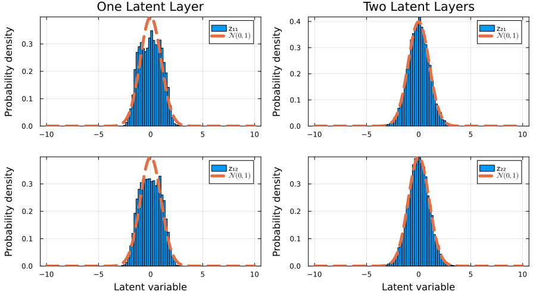

# Hierarchical Variational Autoencoders

In their original formulation, Variational Autoencoders (VAEs) feature a latent 
space whose dimensions typically differ from those of the real data space. The 
primary objective when training a VAE is to optimize an encoder and decoder pair 
that enables smooth translation between the data space and the latent space. 

Unlike traditional deterministic autoencoders, the core advantage of a VAE lies 
in its probabilistic framework. By regularizing the latent space against a known 
prior distribution (such as an isotropic $n$-dimensional Gaussian 
distribution), the latent space becomes continuous and structured, allowing for 
efficient and meaningful data generation via direct sampling.

In practice, standard VAEs often face limitations in sample generation quality. 
They can produce blurry outputs or suffer from posterior collapse, a phenomenon 
where the decoder completely ignores the latent variables. To capture more 
complex data distributions and improve fidelity, additional latent layers can be 
introduced using a hierarchical architecture, known in the literature as 
Hierarchical VAEs (HVAEs) [Sonderby2016, Havtorn2021](@cite). In an HVAE, the 
generative process flows from the top layer downward: the top-most latent layer 
$z_L$ is unconditional and drawn from a standard isotropic normal prior, 
$p(z_L) = \mathcal{N}(0, I)$, while all subsequent lower latent layers $z_1, 
\dots, z_{L - 1}$ are conditional distributions dependent on the latent 
variables of the layers above them $p(z_1 \mid z_2), \dots, p(z_{L-1} \mid 
z_L)$.

## Example 2D Distribution

This module provides fully built-in support for hierarchical latents. For 
example, consider the following two-dimensional training data
```julia
function make_data(num_samples)
    t = (2.0*π) .* rand(Float64,num_samples)

    x_noise = 0.05 .* randn(Float64,num_samples)
    y_noise = 0.05 .* randn(Float64,num_samples)

    x = cos.(1.0.*t) .+ x_noise
    y = sin.(2.0.*t) .+ y_noise
    
    return x, y
end

num_samples = 5000
x_train, y_train = make_data(num_samples)
train_data = collect(transpose(hcat(x_train,y_train)))
```
we can train two VAE models with one and two latent layers respectively 
with
```julia
L = [1, 2]

models = [GenerativeModelProtocols.VariationalAutoencoder(2, 2, l) for l in L]
protocols = [GenerativeModelProtocol(model, train_data;
    batchsize = 256,
    epochs = 3500,
    optimiser = Adam(; eta = 1.0E-4, beta = (0.95,0.999)),
    device = cpu_device()
) for model in models]

for i in eachindex(protocols)
    train!(protocols[i]; β = 0.1)
end
```
and finally we can make synthetic data with both trained models with
```julia
synthetic_data = [protocol(num_samples) for protocol in protocols]
```

from which we can observe that the HVAE with two latent layers visibly 
outperforms the single latent layer vanilla VAE.

## Latent Variables Comparison

Likewise, we can also compare the distribution of the latent variables, of the 
last latent layers, to see how closely they resemble a isotropic normal 
distribution
```julia
x_test, y_test = make_data(10000)
test_data = collect(transpose(hcat(x_test,y_test)))
z_test_data_1 = GenerativeModelProtocols.encode(protocols[1],test_data)
z_test_data_2 = GenerativeModelProtocols.encode(protocols[2],test_data)
```

from which we can easily see that our HVAE with two latent layers, once again, 
visibly outperforms our vanilla VAE with one latent layer.

## Source code

The scripts used to create and train the HVAEs, and to produce all the plots 
shown in this page are included in the `examples` folder of this module.
```bash
cd /path/to/GenerativeModelProtocols.jl/examples/hierarchical_vaes
julia hvae_example.jl
```