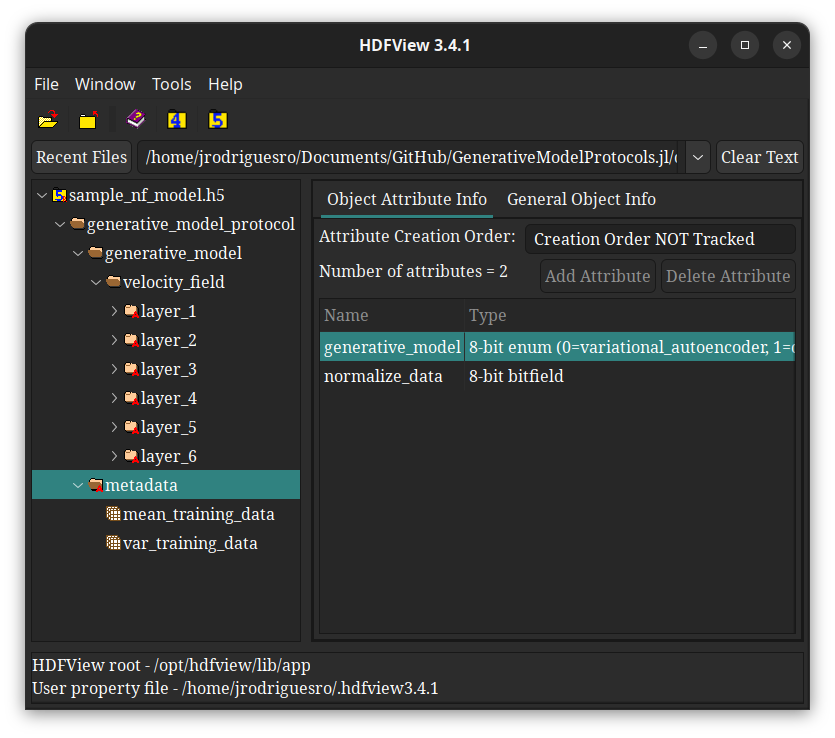

# Saving and Loading Models

This module provides convenient functionality for saving and loading trained 
generative models in the [HDF5](https://hdfgroup.org) file format. 
[HDF5](https://hdfgroup.org) was specifically chosen to maximize 
interoperability. This ensures your trained models remain accessible and usable 
across other software solutions, even if those systems do not use this module or 
the Julia programming language at all.

To access this functionality, one only needs to load the Julia modules 
[`FileIO.jl`](https://github.com/juliaio/fileio.jl) and
[`HDF5.jl`](https://github.com/JuliaIO/HDF5.jl)
```julia
using GenerativeModelProtocols
using FileIO, HDF5
```
finally, we can save an already trained model
```julia-repl
julia> protocol
GenerativeModelProtocol:
training_data = Nothing
epochs        = 100
batchsize     = 32
shuffle       = true
optimiser     = Optimisers.Adam(eta=0.01, beta=(0.9f0, 0.999f0), epsilon=1.0e-8)
device        = CPUDevice
model         = GenerativeModelProtocols.NormalizingFlow

julia> protocol.model
GenerativeModelProtocols.NormalizingFlow:
velocity_field: 
   Chain(
      Dense(3 => 32, swish)
      Dense(32 => 32, swish)
      Dense(32 => 32, swish)
      Dense(32 => 32, swish)
      Dense(32 => 32, swish)
      Dense(32 => 2)
   )
```
to a file named `file_name.h5` with a single function call
```julia-repl
julia> save("file_name.h5", protocol)
```

```@raw html
<div style="text-align: center; margin: 00px 0;">
    
</div>
```

Likewise, we can load our saved model again with a single function call
```julia-repl
julia> loaded_protocol = GenerativeModelProtocol("file_name.h5")
GenerativeModelProtocol:
training_data = Nothing
epochs        = 100
batchsize     = 32
shuffle       = true
optimiser     = Optimisers.Adam(eta=0.01, beta=(0.9f0, 0.999f0), epsilon=1.0e-8)
device        = CPUDevice
model         = GenerativeModelProtocols.NormalizingFlow

julia> loaded_protocol.model
GenerativeModelProtocols.NormalizingFlow:
velocity_field: 
   Chain(
      Dense(3 => 32, swish)
      Dense(32 => 32, swish)
      Dense(32 => 32, swish)
      Dense(32 => 32, swish)
      Dense(32 => 32, swish)
      Dense(32 => 2)
   )
```
