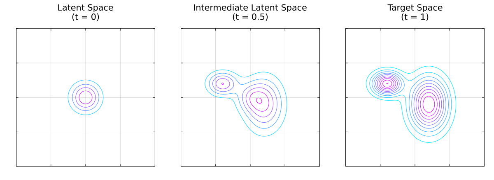

# Normalizing Flows

Normalizing Flows (NFs) [Danilo2015](@cite) are generative models that, that 
unlike most generative models, its transtion between latent to target data 
spaces is done via a determistic velocity field. Moreover, since this velocity 
field is deterministic the transition beteen latent and target spaces is 
invertible. Like Diffusion Models (DMs), the latent space and target space 
are of equal dimensions, unlike Variational Autoencoders (VAEs) that allow 
smaller or larger dimensional latent spaces.

Once a NF is trained, its velocity field can be used as a generative model. This 
generation process is possible because the trained velocity field begins with 
statistically independent latent variables, allowing us to simply seed the 
network with pure random noise to synthesize completely new data.



# Velocity Field

The core component of a Continuous Normalizing Flow (CNF) is a velocity field, 
typically parameterized by a trained Artificial Neural Network (ANN), that 
governs the transformation of randomly sampled data from a simple latent 
distribution (*e.g.*, isotropic Gaussian noise) to a target distribution. 
Because this velocity field defines a deterministic path, mapping data between 
the latent and target spaces is completely invertible. Encoding and decoding 
will yield the exact original data, provided a sufficiently accurate numerical 
integrator is used.

Mapping data between the latent and target spaces entails solving a first-order 
Ordinary Differential Equation (ODE). Consequently, executing a trained CNF 
requires a numerical integrator, such as the fourth-order Runge-Kutta method. 
Mathematically, this is expressed as:
```math
    \frac{\mathrm{d}}{\mathrm{d} t} x (t) = v_\theta \left( x(t), t \right),
```
where $v_\theta $ represents the velocity field parameterized by the trained 
weights $\theta$. The integration boundaries map the respective spaces:
```math
    x (0) \sim \mu_\text{latent} \quad \text{and} 
        \quad x (1) \sim \mu_\text{target},
```
where $\mu_\text{latent}$ and $\mu_\text{target}$ denote the probability 
distributions of the latent and target spaces, respectively.

# Flow Matching

While it is necessary to solve a first order ODE to use a trained CNF, during 
training it is possible to bypass the need of a numerical integrator, thus, 
substantially reducing code complexity and computational cost. This is possible 
using a technique known as *Flow Matching* (FM).

Instead of backpropagating gradients through an expensive ODE solver over 
multiple time steps, Flow Matching formulates a regression objective that 
directly matches the model's velocity field $v_\theta(x, t)$ to a known, target 
vector field $u_t(x)$. 

### The Ideal Objective

If we had access to the true, time-dependent vector field $u_t(x)$ that 
generates the target distribution from the latent distribution, we could train 
the neural network weights $\theta$ by minimizing the expected $L_2$ error:

```math
\mathcal{L}_{\text{FM}}(\theta) = \mathbb{E}_{t \sim \mathcal{U}(0, 1), \, x 
    \sim p_t(x)} \left[ \Vert{} v_\theta(x, t) - u_t(x) \Vert{}^2 \right],
```

where $t$ is uniformly sampled between $0$ and $1$, and $p_t(x)$ represents the 
intermediate probability density along the path. However, this ideal objective 
is intractable in practice because both the true vector field $u_t(x)$ and the 
marginal density path $p_t(x)$ are unknown and depend on the complex target 
distribution.

### Conditional Flow Matching (CFM)

To circumvent this limitation, FM breaks down the complex global problem into 
simpler, data-conditioned subproblems. By conditioning the path on a specific 
data sample $x_1 \sim \mu_\text{target}$ and a latent sample $x_0 \sim 
\mu_\text{latent}$, we define a conditional probability path $p_t(x \vert{} x_0, 
x_1)$ and a conditional vector field $u_t(x \vert{} x_0, x_1)$. 

Crucially, it can be proven that the gradients of the conditional objective are 
equivalent to the gradients of the intractable global objective. This yields the 
tractable *Conditional Flow Matching* (CFM) loss:
```math
\mathcal{L}_{\text{CFM}}(\theta) = \mathbb{E}_{t, x_0, x_1, x} \left[ \Vert{} 
    v_\theta(x, t) - u_t(x \vert{} x_0, x_1) \Vert{}^2 \right],
```
where $t \sim \mathcal{U}(0, 1) $, $\ x_0 \sim \mu_\text{latent}$, 
$\ x_1 \sim \mu_\text{target} \ $ and $ \ x \sim p_t(x \vert{} x_0, x_1)$.

### Optimal Transport (Linear) Paths

A standard and highly efficient choice for the conditional path is the *Optimal 
Transport* (OT) displacement map, which defines straight, constant-velocity 
trajectories from the noise to the data. Assuming an isotropic Gaussian latent 
distribution $\mu_\text{latent} = \mathcal{N}(0, I)$, the conditional path and 
its corresponding velocity field can be written in closed-form as:
```math
\begin{gather*}
    x_t = (1 - t)x_0 + tx_1 \implies p_t(x \mid x_0, x_1) = \mathcal{N}\left(x; 
        \, tx_1, \, (1-t)^2I\right),
\end{gather*}
```
hence
```math
    u_t(x | x_0, x_1) = x_1 - x_0.
```

Substituting the path $x = (1 - t)x_0 + tx_1$ and this conditional vector 
field directly into the conditional loss gives a simple, simulation-free objective:
```math
    \mathcal{L}_{\text{OT-CFM}}(\theta) = \mathbb{E}_{t, \, x_0, \, x_1} \left[
        \Vert{} v_\theta\big((1 - t)x_0 + tx_1, \, t\big) - (x_1 - x_0) 
        \Vert{}^2      \right].
```

During training, optimization relies entirely on evaluating simple algebraic 
expressions. By swapping out the sequential ODE integration loop for an 
unrolled, single-step mean squared error objective, training scales efficiently 
to high-dimensional datasets.

