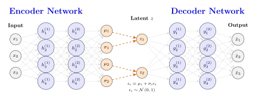

# Variational Autoencoders

Variational Autoencoders (VAEs) are among the simplest generative models capable 
of learning an unknown probability density distribution from a data collection. 
Generally, a VAE consists of two primary components: an *encoder* and a 
*decoder*. The goal of the encoder is to map a recorded observation to a 
lower-dimensional *latent variable*. This latent variable follows a well-known 
probability distribution that is easy to sample from. Conversely, the decoder 
transforms these sampled latent variables back into the original 
higher-dimensional data space.

Once a VAE is trained, its decoder can be used as a generative model. Because 
the latent space is designed to be simple, generating new random observations 
merely requires sampling directly from this distribution. Typically, these 
latent variables are optimized to be statistically independent, following a 
normal distribution with zero mean and unit variance.

```@raw html
<div style="text-align: center; margin: 1em 0;">
    
</div>
```
## Evidence Lower Bound

Before addressing any other training steps, such as optimizer selection, one 
must define an appropriate objective function. For deterministic models, this 
choice is relatively trivial because intuitive objective functions are 
straightforward to formulate. For instance, regression tasks often rely on 
Mean Squared Error (MSE), whereas for classification tasks Cross-Entropy loss
is often used. For probabilistic models like VAEs, however, the objective 
function must be derived from probability theory to handle data distributions 
rather than point predictions.

As established, the latent variables $z$ of a VAE are stochastic, originating 
from an explicitly chosen prior distribution $p(z)$ for which sampling is 
tractable. Consequently, we seek to maximize the log-likelihood of our observed 
training data $x$ by marginalizing over these latent variables:
```math
\log \left( p (x) \right) = \log \left( \int p (x,z) \mathrm{d}z \right) .
```
However, because the true posterior distribution $p(z|x)$ is unknown, this 
marginal integral is analytically intractable, approximations must be made.

To address this intractability, we introduce a variational distribution 
$q_\phi(z|x)$ parameterized by an encoder neural network with parameters 
$\phi$ to approximate the true, intractable posterior $p(z|x)$. By expanding the 
integral with this variational distribution, we can rewrite the log-likelihood 
as an expectation:
```math
\begin{align*}
\log \left( p(x) \right) &= \log \left( \int q_\phi(z|x) 
    \frac{p(x,z)}{q_\phi(z|x)} \mathrm{d}z \right) \\[0.5cm]
&= \log \left( \mathbb{E}_{q_\phi(z|x)} \left[ 
    \frac{p(x,z)}{q_\phi(z|x)} \right] \right).
\end{align*}
```

Since the logarithm function is concave, applying Jensen's inequality allows us 
to bound the log-likelihood from below, yielding the Evidence Lower Bound 
(ELBO):
```math
\begin{align*}
\log \left( p(x) \right) \geq \mathbb{E}_{q_\phi(z|x)} \left[ \log \left( 
    \frac{p(x,z)}{q_\phi(z|x)} \right) \right]
&= \mathbb{E}_{q_\phi(z|x)} \left[ \log \left( p(x,z) \right) - 
    \log \left( q_\phi(z|x) \right) \right] \\[0.3cm]
&= \mathbb{E}_{q_\phi(z|x)} \left[ \log \left( p_\theta (x|z) \right) + 
    \log \left( p(z) \right) - \log \left( q_\phi(z|x) \right) \right] \\[0.3cm]
&= \mathbb{E}_{q_\phi(z|x)} \left[ \log \left( p_\theta (x|z) \right) \right] 
    - \mathbb{E}_{q_\phi(z|x)} \left[ \log \left( \frac{q_\phi(z|x)}{p(z)} 
    \right) \right] \\[0.3cm]
&= \mathbb{E}_{q_\phi(z|x)} \left[ \log \left( p_\theta (x|z) \right) \right] 
    - D_\text{KL} \left( q_\phi(z|x) \ \parallel \ p(z) \right).
\end{align*}
```
Here, $p_\theta(x\vert{}z)$ represents the generative model parameterized by a 
decoder neural network with weights $\theta$, and $D_{\text{KL}}$ denotes the 
Kullback-Leibler (KL) divergence.

Finally, because maximizing the ELBO is equivalent to minimizing its negative, 
we can jointly train the encoder and decoder neural networks by solving the 
following optimization problem:
```math
\begin{matrix} \text{argmin} \\ \phi, \theta\end{matrix} \hspace{0.3cm}
    D_\text{KL} \left( q_\phi(z|x) \ \parallel \ p(z) \right) - 
    \mathbb{E}_{q_\phi(z|x)} \left[ \log \left( p_\theta (x|z) \right) \right]. 
```

## Implementation Considerations

To practically implement and train a VAE, several critical architectural and 
optimization challenges must be addressed:
* __The Reparameterization Trick__: Standard stochastic sampling breaks the 
  computational graph because it is non-differentiable. To allow backpropagation 
  via reverse-mode automatic differentiation, the stochastic component must be 
  isolated. This is achieved by defining $z$ through a deterministic mapping 
  that ingests external noise, typically formulated as $z = \mu_\phi(x) + 
  \sigma_\phi(x) \odot \epsilon$, where $\epsilon \sim \mathcal{N}(0, I)$.
* __Analytical KL Divergence__: Evaluating the KL divergence via sampling is 
  computationally expensive and introduces high variance. To ensure this term 
  has a tractable, closed-form algebraic solution, the approximate posterior 
  $q_\phi(z\vert{}x)$ and the prior $p(z)$ are conventionally chosen from the 
  same family, usually multivariate Gaussians with diagonal covariance matrices.
* __Formulating the Reconstruction Loss__: The expected log-likelihood term 
  $\mathbb{E}_{q_\phi(z\vert{}x)} [\log p_\theta(x\vert{}z)]$ translates 
  directly into standard loss functions depending on the assumed distribution 
  of the data. For continuous data modeled as a Gaussian distribution, this term 
  simplifies exactly to Mean Squared Error (MSE). For binary or normalized data 
  modeled as a Bernoulli distribution, it simplifies to Binary Cross-Entropy 
  (BCE).
* __Hyperparameter Balancing ($\beta$-VAE and KL Vanishing)__: In practice, 
  VAEs often suffer from "KL vanishing," an optimization trap where the encoder 
  collapses to the prior $\left( D_\text{KL} \to 0 \right)$ and the decoder 
  ignores the latent space entirely. To prevent this, a scaling hyperparameter 
  $\beta$ is introduced to weight the KL term. While $\beta = 1$ satisfies the 
  strict mathematical derivation of the ELBO, $\beta$ is often dynamically 
  scheduled (KL annealing) or tuned arbitrarily: $\beta < 1$ prioritizes sharp 
  reconstructions, whereas $\beta > 1$ enforces stricter latent independence at 
  the expense of output detail.
* __Hierarchical Latents__: A single layer of latent variables assumes a simple 
  flat distribution, which often lacks the mathematical flexibility to model 
  complex data distributions. To increase model capacity, Hierarchical VAEs 
  (HVAEs) stack latent variables into sequential layers. This structural change 
  allows the network to partition the representation task, tracking large-scale 
  structural patterns in the top layers and smaller, detailed variations in the 
  lower layers.